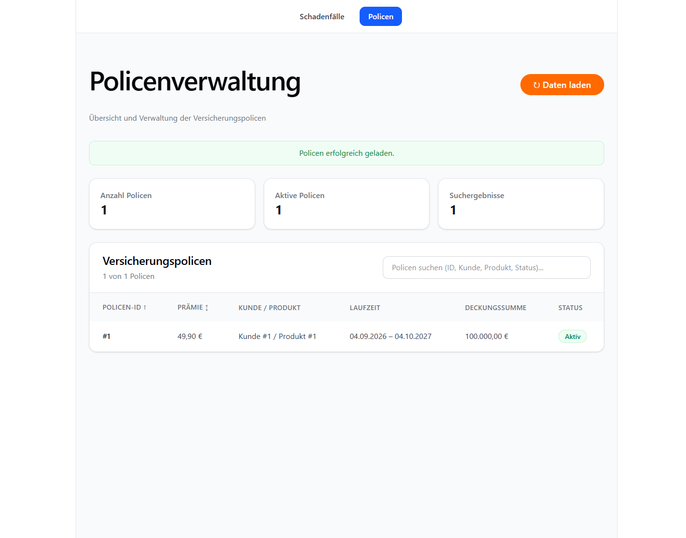
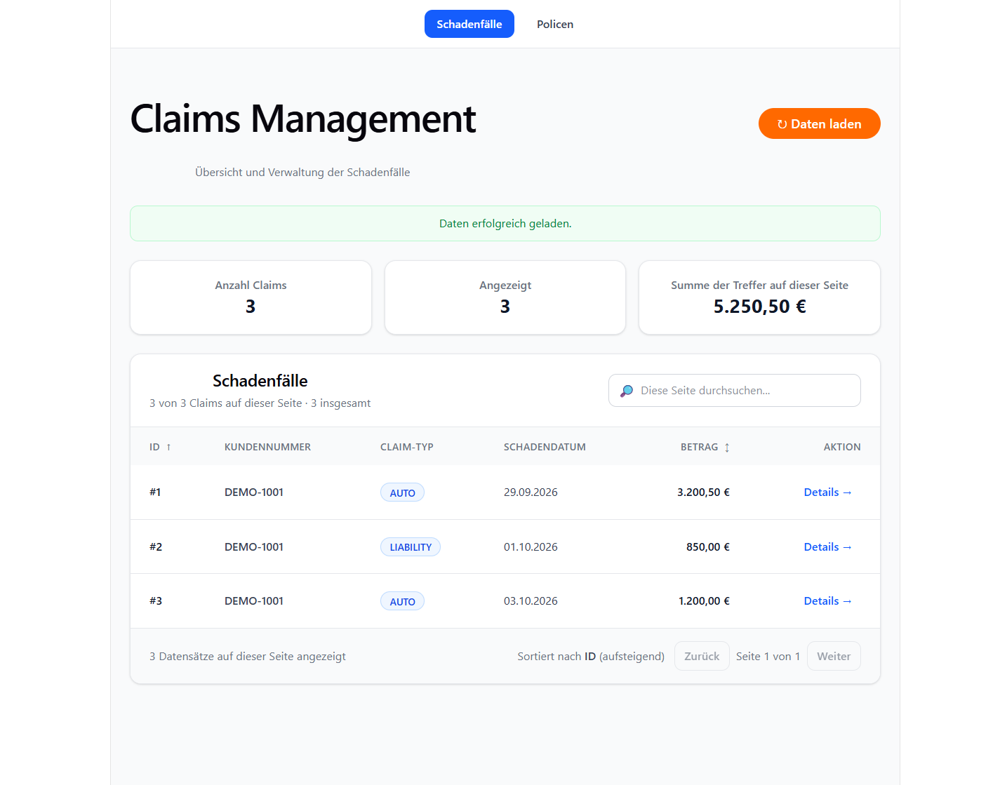

# Insurance Platform

<table>
  <tr>
    <td align="center">
      
      <sub>Policenübersicht</sub>
    </td>
    <td align="center">
      
      <sub>Schadenfall-Dashboard</sub>
    </td>
  </tr>
</table>

Portfolio-Projekt für die digitale Abbildung ausgewählter Versicherungsprozesse.
Das Monorepo verbindet ein Spring-Boot-Backend mit einem React-Frontend und
entwickelt den fachlichen Umfang sowie die Architektur schrittweise weiter.

## Funktionen

Die REST-API bildet derzeit folgende Abläufe ab:

- Kunden und Versicherungsprodukte anlegen und abrufen
- Policen ausstellen, anzeigen und kündigen
- Schadenfälle melden, paginiert und nach Police gefiltert abrufen sowie ihren
  Bearbeitungsstatus verwalten
- Auszahlungen zu genehmigten Schäden erzeugen und durch Admins als bezahlt
  markieren
- Policen auf ihre Eignung für einen Antrag prüfen

Die Weboberfläche enthält aktuell Ansichten für Schadenfälle und Policen. Die
übrigen Funktionen sind über die REST-API verfügbar. Der Umfang ist ein
Portfolio- und Lernprojekt, keine produktionsfertige Versicherungsplattform.

## Tech-Stack

| Bereich             | Technologien                                                          |
| ------------------- | --------------------------------------------------------------------- |
| Backend             | Java 21, Spring Boot 3, Spring Data JPA, Hibernate, Spring Modulith   |
| API und Validierung | REST, OpenAPI/Swagger, Jakarta Bean Validation                        |
| Datenbanken         | H2 für Entwicklung und Tests; PostgreSQL mit Flyway im Profil `local` |
| Frontend            | React 19, TypeScript, Vite, Tailwind CSS                              |
| Qualitätssicherung  | Maven, JUnit, Mockito, ESLint, GitHub Actions                         |
| Container           | Docker und Docker Compose                                             |

## Architektur

Das Backend ist als modularer Monolith organisiert: Fachbereiche wie Kunden,
Produkte, Policen, Schäden und Billing sind Spring-Module mit klaren Grenzen.
Genehmigte Schadenfälle lösen ein Event aus, aus dem Billing idempotent eine
Auszahlung erstellt.

Weitere Informationen:

- [Architekturüberblick](docs/architecture.md)
- [Technische Architektur- und API-Dokumentation](docs/architecture/technical-documentation.md)
- [Architektur-Roadmap](docs/architecture/architecture-roadmap.md)
- [API-Dokumentation und Swagger](docs/api/README.md)

## Voraussetzungen

- Java 21
- Node.js 22 oder neuer
- npm
- Docker Desktop (optional, für PostgreSQL über Compose)

## Lokal starten

Frontend-Abhängigkeiten einmalig aus dem Repository-Stamm installieren:

```powershell
npm ci --prefix frontend
```

Backend mit dem Standardprofil `dev` und eingebettetem H2 starten. Dieses Profil
legt bei jedem Start die Demo-Daten neu an; die H2-Datenbank ist flüchtig:

```powershell
.\backend\mvnw.cmd -f backend\pom.xml spring-boot:run
```

Unter macOS/Linux den Maven Wrapper so starten:

```bash
bash backend/mvnw -f backend/pom.xml spring-boot:run
```

In einem zweiten Terminal das Frontend starten:

```sh
npm run dev
```

Das Frontend ist unter <http://localhost:5173> erreichbar. Vite leitet
`/api`-Anfragen an das Backend unter <http://localhost:8080> weiter.

Für eine persistente lokale PostgreSQL-Umgebung kann stattdessen der Backend-
und Datenbank-Container gestartet werden:

```powershell
docker compose up --build
```

Compose startet PostgreSQL und das Backend mit dem Profil `local`; das
Frontend kann weiterhin separat mit `npm run dev` gestartet werden. Die
PostgreSQL-Datenbank wird über ein Docker-Volume gespeichert. Demo-Daten nach
einem leeren Datenbankstart einmalig laden:

```powershell
Get-Content -Raw backend\src\main\resources\db\dev-data.sql |
  docker compose exec -T postgres psql -U insurance -d insurance
```

Zum Herunterfahren:

```powershell
docker compose down
```

## Deployment

Pushes to `main` build and publish the backend and Caddy images to GitHub
Container Registry. The Caddy image contains the built frontend, serves the
single-page application, and proxies `/api` requests to the backend. Only Caddy
publishes ports to the host; the database is on an internal network. Both images
are deployed over SSH. Prepare the server with Docker Compose and a clone of
this repository at `~/insurance-platform`. The clone must be on `main`, have
credentials that allow `git fetch`. Each deployment uses a temporary detached
worktree at the deployed commit, so unrelated local changes in the server clone
do not block deployment. Compose uses the fixed project name
`insurance-platform` to keep the existing PostgreSQL volume.

Point your domain's DNS A/AAAA records at the server and allow inbound TCP
ports `80` and `443` (plus UDP `443` for HTTP/3). Create
`~/insurance-platform/.env` on the server with the domain and a strong database
password before the first deployment:

```dotenv
DOMAIN=app.example.com
POSTGRES_PASSWORD=replace-with-a-long-random-password
```

Compose defaults to the `ghcr.io/hunark176/insurance-platform` image prefix and
the `latest` image tag. Set `IMAGE_PREFIX` or `IMAGE_TAG` in this `.env` only
when deploying images from another registry/repository or pinning a specific
tag; the GitHub Actions deployment supplies both values automatically.

Add these repository Actions secrets under **Settings → Secrets and variables
→ Actions**: `SSH_HOST`, `SSH_USER`, and `SSH_KEY`. `SSH_PORT` is optional and
defaults to `22`. The workflow uses `GITHUB_TOKEN` to log in to GHCR on the
server, so the repository token must be allowed to read the published package.
Caddy obtains and renews HTTPS certificates automatically and proxies API
requests to the backend and other requests to the frontend.

Nach dem ersten Deployment oder wenn nur die Datensätze gelöscht wurden, kann
die gleiche idempotente Demo-Datei auf dem Server eingespielt werden. Das
Beispiel verwendet die Standardnamen `insurance`; bei abweichenden
`POSTGRES_USER`- oder `POSTGRES_DB`-Werten diese entsprechend ersetzen:

```bash
cd ~/insurance-platform
docker compose -f docker-compose.prod.yml exec -T db \
  sh -c 'psql -U "$POSTGRES_USER" -d "$POSTGRES_DB"' \
  < backend/src/main/resources/db/dev-data.sql
```

Die Datei stellt ausschließlich Demo-Kunde, Demo-Produkt, eine Police und drei
Schäden wieder her. Gelöschte echte Daten können nur aus einem Datenbank-Backup
wiederhergestellt werden. Das PostgreSQL-Volume nicht mit `docker compose down
-v` löschen.

Die API verwendet derzeit HTTP Basic und stellt die Demo-Benutzer
`customer/customer`, `clerk/clerk` und `admin/admin` als In-Memory-Konten
bereit. Diese Zugangsdaten sind ausschließlich für die Entwicklung gedacht
und müssen vor einem produktiven Einsatz ersetzt werden.

## Qualitätssicherung

```powershell
npm run lint
npm run build
npm run test:backend
```

`npm run test:backend` ist für PowerShell/Windows eingerichtet. Unter
macOS/Linux kann der Backend-Testlauf direkt über den Maven Wrapper gestartet
werden:

```bash
bash backend/mvnw -f backend/pom.xml test
```

Die GitHub-Actions-CI führt Frontend-Linting und -Build sowie `mvn verify` für
das Backend aus.

## API ausprobieren

Swagger UI: <http://localhost:8080/swagger-ui.html>

Beispiele für die Claim-Übersicht (Authentifizierung erforderlich):

```text
GET /api/claims?page=0&size=20
GET /api/claims?page=0&size=20&policyId=12345
GET /api/claims/4712
```

Die Claim-Übersicht ist 0-basiert paginiert, liefert standardmäßig 20 und
maximal 100 Einträge pro Seite. Weitere Endpunkte und Antwortformate sind in
Swagger beschrieben.

## Projektstruktur

```text
backend/    Spring-Boot-Anwendung, Tests und Datenbankmigrationen
frontend/   React-/TypeScript-Anwendung
docs/       Architektur-, API- und Entscheidungsdokumentation
infra/      ergänzende Infrastrukturdateien
```
