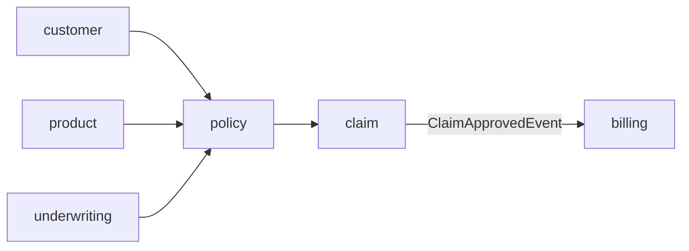

# Architektur

Die Anwendung ist ein modularer Monolith. Jede Fachdomäne besitzt ein eigenes
Spring-Modul mit einer kleinen öffentlichen API. Direkte Aufrufe zwischen
Modulen laufen ausschließlich über `XxxApi`; fachliche Rückmeldungen werden als
Events veröffentlicht.

Der Claim-zu-Payout-Ablauf ist bewusst einseitig: `ClaimService` publiziert
`ClaimApprovedEvent`, der Billing-Listener erzeugt idempotent eine Auszahlung.
Die Architekturprüfung in `ModularityTest` verhindert neue Zyklen und Zugriffe
auf nicht veröffentlichte Modulklassen.

## Lokale Profile

Das Standardprofil `dev` verwendet eine eingebettete H2-Datenbank und Hibernate
zur schnellen Entwicklung. Das Profil `local` verwendet PostgreSQL und Flyway;
die Migrationen liegen unter `backend/src/main/resources/db/migration`.
