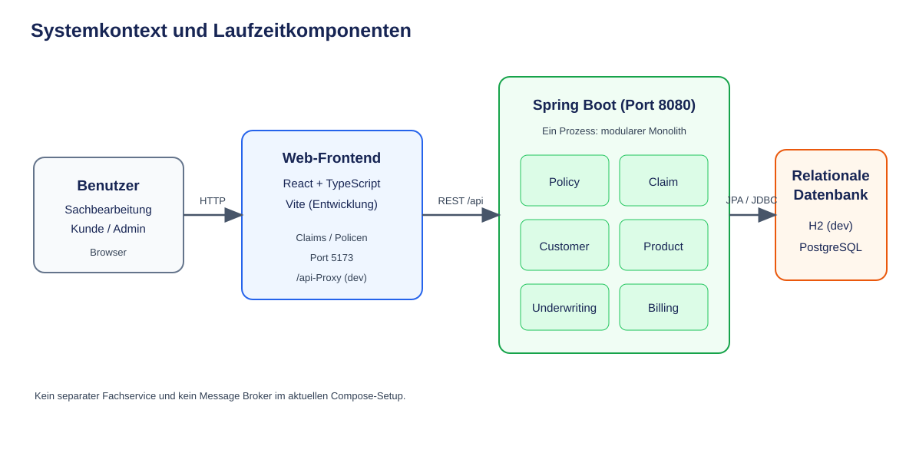
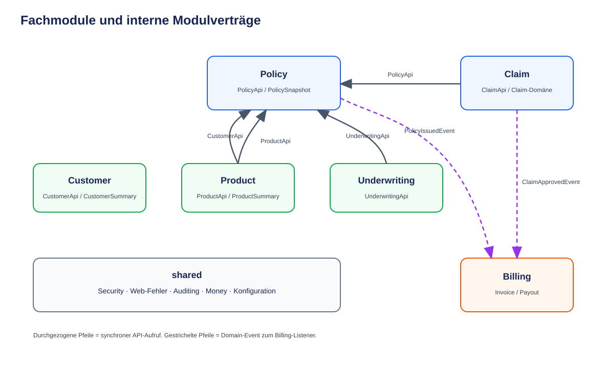
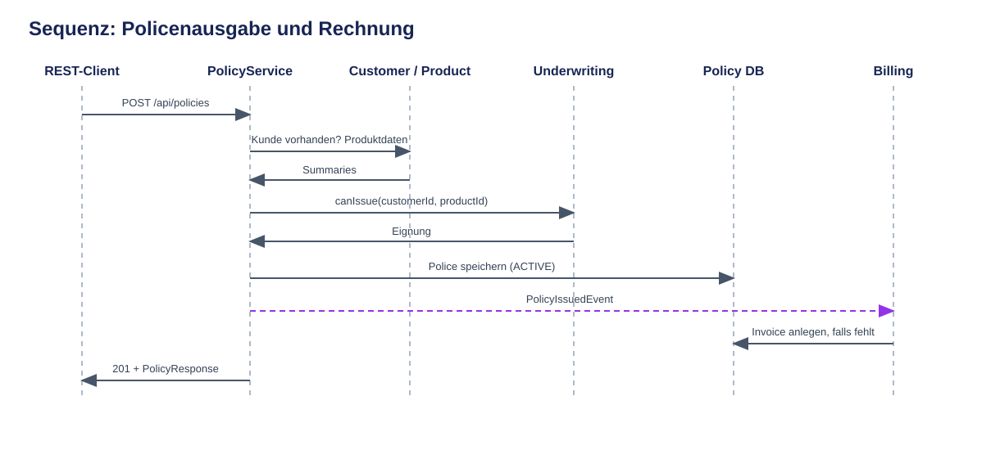
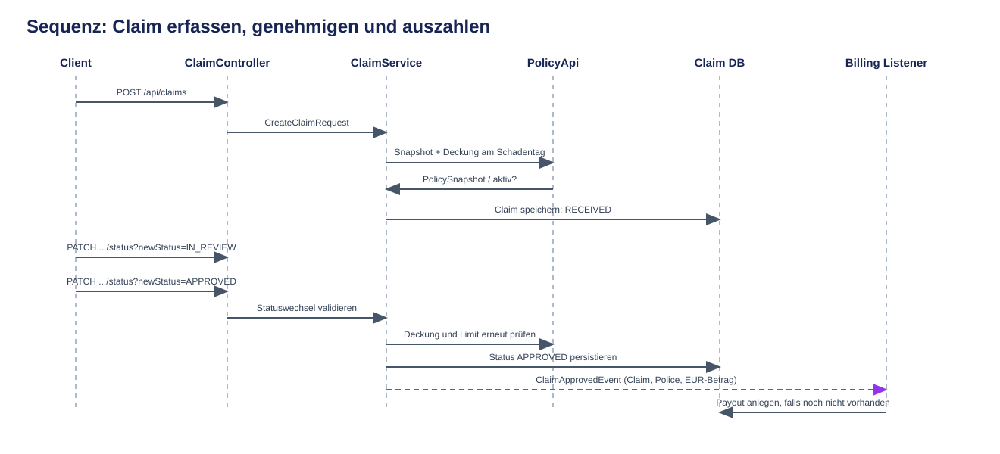

# Insurance Platform

## Technische Architektur- und Schnittstellendokumentation

**Dokumenttyp:** System- und Entwicklerdokumentation
**Erfasst am:** 28. September 2026
**Geltungsbereich:** Implementierter Code im Repository zum Erfassungszeitpunkt
**Status:** Bestandsaufnahme; nicht automatisch gleichbedeutend mit einem freigegebenen Produktionsdesign

> Die Dokumentation beschreibt den vorhandenen Arbeitsstand. Im Repository gibt es
> derzeit lokale, noch nicht eingecheckte Änderungen. Architektur- oder Funktionsangaben
> zu diesen Bereichen beziehen sich deshalb auf den vorgefundenen Arbeitsbaum und
> können vom letzten Commit abweichen. „Vorhanden“ bedeutet nicht zwangsläufig
> „produktionsbereit“.

## 1. Zweck und Leseschlüssel

Diese Dokumentation erklärt den Systemaufbau, die Modulgrenzen, die internen und
externen Schnittstellen, die wichtigsten Abläufe sowie Betrieb und erkennbare
Einschränkungen. Sie ergänzt die vorhandenen ADRs und API-Dokumentation. Der Code
ist bei Abweichungen die maßgebliche Quelle.

| Zeichen                | Bedeutung                                                          |
| ---------------------- | ------------------------------------------------------------------ |
| `-->`                  | synchroner Aufruf / Datenfluss                                     |
| `-.->`                 | asynchrone oder ereignisbasierte Kopplung                          |
| `API`                  | expliziter Modulvertrag innerhalb des Java-Prozesses               |
| `REST`                 | HTTP-Schnittstelle zwischen Browser/Client und Backend             |
| `DB`                   | persistente Datenbank bzw. Entwicklungsdatenbank                   |
| **Ist**                | im aktuellen Quellcode erkennbar                                   |
| **Nicht nachgewiesen** | in diesem Repository nicht als implementiert/verifiziert erkennbar |

Die Diagramme sind als SVG-Dateien abgelegt und in dieser Markdown-Datei
eingebettet. Sie zeigen die wesentlichen Systemgrenzen, nicht jede einzelne Klasse.

## 2. Zusammenfassung

Die Insurance Platform ist ein **modularer Monolith**: ein Spring-Boot-Prozess
mit getrennten fachlichen Java-Modulen und einer gemeinsamen relationalen
Datenbank. Das React-/TypeScript-Frontend wird als separater Web-Client
entwickelt. Im lokalen Entwicklungsbetrieb leitet Vite `/api`-Aufrufe an das
Backend weiter. In Docker Compose laufen Backend und PostgreSQL; ein Frontend-
Container ist dort nicht definiert.

Fachlich umfasst der Code Kunden, Produkte, Policen, Underwriting, Schadenfälle
und Billing. Die wichtigste implementierte Prozesskette lautet:

1. Eine Police wird gegen Kunde, Produkt und Underwriting geprüft und gespeichert.
2. Ein Policenereignis kann eine Rechnung im Billing-Modul auslösen.
3. Ein Schadenfall wird einer Police zugeordnet und beim Erfassen gegen
   Kundennummer und Deckungszeitraum geprüft.
4. Eine Sachbearbeitung führt den Claim durch die Statusmaschine.
5. Bei Genehmigung wird ein Ereignis veröffentlicht; Billing legt daraus
   höchstens eine Auszahlung an.

Die Backend-REST-API ist weiter ausgebaut als die Bedienoberfläche: Das Frontend
zeigt aktuell Listen für Claims und Policen. Für etliche im Backend vorhandene
Schreib- und Verwaltungsoperationen gibt es keine entsprechende UI-Funktion.

## 3. Systemkontext und Laufzeitkomponenten



### 3.1 Laufzeitgrenzen

| Komponente              | Verantwortung                                         | Schnittstelle                       |
| ----------------------- | ----------------------------------------------------- | ----------------------------------- |
| Browser / Mitarbeitende | Bedienung der Claims- und Policenübersicht            | HTTPS/HTTP zum Frontend             |
| React-/Vite-Frontend    | Darstellung, lokale Filter/Sortierung, HTTP-Aufrufe   | Axios, relative `/api/...`-Pfade    |
| Spring-Boot-Anwendung   | REST, Geschäftsregeln, Modulkommunikation, Persistenz | REST auf Port 8080                  |
| H2                      | Standardprofil für lokale Entwicklung                 | In-Memory-JDBC, Datenbank `claimdb` |
| PostgreSQL              | lokale Compose-/produktionsnahe Datenbank             | JDBC, standardmäßig Port 5432       |

Das Backend und die Fachmodule laufen in **einem** Java-Prozess. Es gibt im
Repository keine separat deploybaren Services für Claim, Policy oder Billing
und keinen Message Broker.

### 3.2 Technologien

| Bereich                  | Technologie laut Projektdateien                                                                  |
| ------------------------ | ------------------------------------------------------------------------------------------------ |
| JVM / Sprache            | Java 21                                                                                          |
| Backend                  | Spring Boot 3.5.6, Spring MVC, Spring Data JPA, Hibernate                                        |
| Modularchitektur         | Spring Modulith 1.4.4                                                                            |
| Validierung und Security | Jakarta Bean Validation, Spring Security                                                         |
| Persistenz               | H2 und PostgreSQL 16 (Compose), Flyway                                                           |
| API-Beschreibung         | springdoc-openapi 2.8.13, Swagger UI                                                             |
| Frontend                 | React 19, TypeScript 6, Vite 8                                                                   |
| Frontend-Datenzugriff    | Axios; TanStack Query ist Abhängigkeit, wird in den aktuellen Feature-Hooks jedoch nicht genutzt |
| Styling/UI               | Tailwind CSS 4, Base UI, eigene React-Komponenten                                                |
| Build/Tests              | Maven Wrapper, npm, JUnit/Spring Boot Test, Spring Modulith Test                                 |

Die Versionsangaben in `package.json` enthalten teilweise Versionsbereiche.
Eine genaue, reproduzierbare Frontend-Version ergibt sich aus der jeweiligen
Lockdatei und installierten Abhängigkeiten.

## 4. Backend-Architektur

### 4.1 Architekturstil und Abhängigkeitsrichtung

Das Backend kombiniert fachliche Modularisierung mit Spring MVC und JPA. Ein
REST-Controller übersetzt HTTP in DTOs und ruft einen Anwendungsservice auf.
Services koordinieren Fachregeln und Modul-APIs; Mapper wandeln zwischen
Entities, Snapshots und Response-DTOs. Repositories kapseln Datenzugriff.



Interne Modulaufrufe sind gewöhnliche Java-Aufrufe über veröffentlichte
`XxxApi`-Verträge; sie sind keine Netzwerkaufrufe. Fachereignisse bilden eine
separate, lose gekoppelte Benachrichtigung. `ModularityTest` prüft
Modulabhängigkeiten und soll unzulässige Zugriffe/Zyklen verhindern.

### 4.2 Fachmodule

| Modul          | Zuständigkeit                                                              | Hauptbestandteile                                                                 |
| -------------- | -------------------------------------------------------------------------- | --------------------------------------------------------------------------------- |
| `customer`     | Kundenstammdaten und Kundenzusammenfassungen                               | `CustomerApi`, `CustomerService`, `Customer`, Repository/Adapter, Controller/DTOs |
| `product`      | Versicherungsprodukte und Angebotsparameter                                | `ProductApi`, `ProductService`, `Product`, Repository/Adapter, Controller/DTOs    |
| `underwriting` | einfache Ausgabeberechtigung für Kunde und Produkt                         | `UnderwritingApi`, `UnderwritingService`, Entscheidung/DTO, Controller            |
| `policy`       | Policenausgabe, Laufzeit, Status, Policen-Snapshots                        | `PolicyApi`, `PolicyService`, `Policy`, Repository, Controller/DTOs               |
| `claim`        | Schadenmeldung, Prüfung, Statuswechsel und Genehmigung                     | `ClaimApi`, `ClaimService`, `Claim`, Repository, Events, Controller/DTOs          |
| `billing`      | Rechnungserzeugung bei Policenausgabe und Auszahlung bei Claim-Genehmigung | Listener, `BillingService`, Invoice-/Payout-Domäne, Controller                    |
| `shared`       | querschnittliche Web-, Security-, Persistenz- und Domain-Helfer            | Security, Auditing, `Money`, Exception-Handler, Jackson/OpenAPI-Konfiguration     |

Die tatsächliche Schichtung ist nicht in allen Modulen identisch. Customer und
Product verwenden Repository-Port/Adapter-Dateien; Policy nutzt ein Domain-
Repository; Claim verwendet eine JPA-Entity (`entity/Claim`) und ein Spring-Data-
Repository (`repository/ClaimRepository`). Das ist die bestehende Implementierung,
nicht eine Behauptung, dass jedes Modul bereits eine vollständig isolierte
Domain-Schicht besitzt.

### 4.3 Interne Modul-Schnittstellen

| Vertrag           | Aufrufer → Anbieter                   | Zweck                                                                                                                       |
| ----------------- | ------------------------------------- | --------------------------------------------------------------------------------------------------------------------------- |
| `CustomerApi`     | Policy und Underwriting → Customer    | Existenzprüfung und Lesen benötigter Kundendaten/-zusammenfassungen                                                         |
| `ProductApi`      | Policy und Underwriting → Product     | Produktdaten abrufen und Produktaktivität berücksichtigen                                                                   |
| `UnderwritingApi` | Policy → Underwriting                 | `canIssue(customerId, productId)`                                                                                           |
| `PolicyApi`       | Claim → Policy                        | Einzel-/Batch-Snapshots und `isActiveAt(policyId, date)`                                                                    |
| `ClaimApi`        | fachlicher Vertrag des Claim-Moduls   | `hasOpenClaims(policyId)`; im erfassten Implementierungspfad nicht als Policy-Aufruf nachgewiesen                           |
| `BillingApi`      | fachlicher Vertrag des Billing-Moduls | Abfrage, ob für einen Claim bereits eine Auszahlung existiert; konkrete Verwendung außerhalb des Moduls ist nicht erkennbar |

Wesentliche, im Code vorhandene Signaturen:

```java
// Policy-Modul: Vertrag, den Claim zur Deckungsprüfung verwendet
PolicySnapshot getSnapshot(Long policyId);
List<PolicySnapshot> getSnapshots(Collection<Long> policyIds);
boolean isActiveAt(Long policyId, LocalDate date);

// Underwriting-Modul
boolean canIssue(Long customerId, Long productId);

// Claim-Modul
boolean hasOpenClaims(Long policyId);
```

`PolicySnapshot` und die Customer-/Product-Summary-Typen transportieren für
Modulgrenzen benötigte Daten, statt JPA-Entities anderer Module direkt
weiterzureichen. Der Policy-Snapshot enthält die für Claim relevanten Policen-
und Kundendaten, darunter Policen-ID, Kundennummer, Laufzeit, Status und
Deckungsgrenze.

### 4.4 Ereignisverträge

| Ereignis               | Publisher                                 | Beobachtete Wirkung                                                                                  |
| ---------------------- | ----------------------------------------- | ---------------------------------------------------------------------------------------------------- |
| `PolicyIssuedEvent`    | `PolicyService.issue`                     | `PolicyIssuedListener` im Billing prüft auf vorhandene Rechnung und erzeugt andernfalls eine Invoice |
| `ClaimApprovedEvent`   | `ClaimService.updateClaim` bei `APPROVED` | `ClaimApprovedListener` im Billing legt andernfalls eine Payout an                                   |
| `ClaimSubmittedEvent`  | im erfassten Pfad kein Publisher gefunden | keine aktive Folgeaktion nachgewiesen                                                                |
| `ClaimRejectedEvent`   | im erfassten Pfad kein Publisher gefunden | keine aktive Folgeaktion nachgewiesen                                                                |
| `PolicyCancelledEvent` | im erfassten Pfad kein Publisher gefunden | keine aktive Folgeaktion nachgewiesen                                                                |

Die Listener verwenden Spring Modulith `@ApplicationModuleListener`. Beide
Billing-Listener prüfen vor dem Einfügen auf ein vorhandenes Objekt; zusätzlich
ist `payouts.claim_id` in der Baseline eindeutig. Eine persistente Outbox,
externe Event-Infrastruktur oder garantierte Wiederzustellung bei
Prozessausfall ist in der Projektkonfiguration **nicht nachgewiesen**. Die ADR
`docs/adr/0002-spring-modulith-events-outbox.md` beschreibt die Outbox als
mögliche Ergänzung, nicht als zugesicherte aktuelle Betriebsfunktion.

## 5. Frontend-Architektur

### 5.1 Aufbau

`frontend/src/main.tsx` mountet die React-Anwendung; `App.tsx` schaltet über
lokalen React-State zwischen zwei Ansichten um. Ein URL-Router ist nicht
konfiguriert.

| Feature | UI-Bausteine                                                                     | Datenzugriff und sichtbare Funktion                              |
| ------- | -------------------------------------------------------------------------------- | ---------------------------------------------------------------- |
| Claims  | `ClaimForm` (tatsächlich Listenansicht), `ClaimStats`, `ClaimTable`, `useClaims` | Claims seitenweise laden, aktuelle Seite lokal filtern/sortieren und Summen darstellen |
| Policen | `PolicyManagement`, `PolicyStats`, `PolicyTable`, `usePolicies`                  | Policen laden, lokal filtern/sortieren und Kennzahlen darstellen |

Die API-Services verwenden Axios und relative Pfade (`/api/claims`,
`/api/policies`). Hooks verwalten Lade-/Fehler-/Such-/Sortierzustand mit
`useState` und `useEffect`. Die React Query-Abhängigkeit ist im aktuellen
Datenfluss nicht eingebunden. Vite proxyt im Entwicklungsserver `/api` an
`http://localhost:8080`.

### 5.2 Grenzen der aktuellen Oberfläche

- Der Name `ClaimForm` ist historisch/missverständlich: Die Komponente zeigt
  eine Claims-Übersicht; sie sendet keine Schadenmeldung.
- Die Policenansicht ist ebenfalls eine Leseansicht.
- Claim-Status ändern, Claim löschen, Police ausstellen/kündigen, Kunden,
  Produkte, Underwriting, Rechnungen und Auszahlungen haben keine entsprechende
  Frontend-Bedienoberfläche.
- „Details“ in der Claim-Tabelle ist keine echte Detailnavigation.
- Die Services konfigurieren keine HTTP-Basic-Anmeldedaten und setzen keinen
  Authentifizierungsheader. Das geschützte Backend weist nicht authentifizierte
  API-Aufrufe zurück. Die UI hat daher derzeit keinen vollständigen Login-Fluss.
- Die Backend-Antwort und der Frontend-Claim-Typ sind nicht vollständig
  deckungsgleich; Felder wie Status/Policy-Zuordnung fehlen im Frontend-Typ.

## 6. HTTP- und REST-Schnittstellen

### 6.1 Gemeinsame Konventionen

- Basispräfix: `/api`
- JSON über Spring MVC; Request-DTOs werden teilweise mit Bean Validation
  geprüft.
- OpenAPI: `/v3/api-docs`; Swagger UI: `/swagger-ui.html`.
- Nicht gefunden: HTTP 404 mit `ProblemDetail`.
- Domain-/Zustands-/Argumentfehler: HTTP 422 mit `ProblemDetail`.
- Bean-Validation-, Authentifizierungs- und Autorisierungsfehler werden nicht
  durch den genannten globalen Exception-Handler in ein eigenes gemeinsames
  fachliches Format überführt.
- IDs sind numerische Datenbank-IDs (Long).

### 6.2 Routenübersicht

Alle Routen sind durch HTTP Basic geschützt, sofern sie nicht explizit für
Dokumentation, H2-Konsole oder Health freigegeben sind. Methodenrollen gelten
zusätzlich zur allgemeinen Authentifizierung.

| Methode und Pfad                              | Zweck / Ein- und Ausgabe                         | Zugriff                |
| --------------------------------------------- | ------------------------------------------------ | ---------------------- |
| `GET /api/claims`                             | Claim-Liste als `ClaimResponse[]`                | angemeldet             |
| `GET /api/claims/{id}`                        | Claim-Details                                    | angemeldet             |
| `POST /api/claims`                            | `CreateClaimRequest` → `ClaimResponse`, HTTP 201 | CUSTOMER, CLERK, ADMIN |
| `PATCH /api/claims/{id}/status?newStatus=...` | Statuswechsel → Claim-Antwort                    | CLERK, ADMIN           |
| `DELETE /api/claims/{id}`                     | Claim löschen, HTTP 204                          | CLERK, ADMIN           |
| `GET /api/policies`                           | Policenliste                                     | angemeldet             |
| `GET /api/policies/{id}`                      | Policendetail                                    | angemeldet             |
| `POST /api/policies`                          | `IssuePolicyRequest` → Police, HTTP 201          | CLERK, ADMIN           |
| `POST /api/policies/{id}/cancel`              | Police kündigen                                  | CLERK, ADMIN           |
| `GET /api/customers`                          | Kundenliste                                      | CLERK, ADMIN           |
| `GET /api/customers/{id}`                     | Kundendetail                                     | CUSTOMER, CLERK, ADMIN |
| `POST /api/customers`                         | `CreateCustomerRequest` → Kunde, HTTP 201        | CLERK, ADMIN           |
| `GET /api/products`                           | Produktliste                                     | angemeldet             |
| `GET /api/products/{id}`                      | Produktdetail                                    | angemeldet             |
| `POST /api/products`                          | `CreateProductRequest` → Produkt, HTTP 201       | CLERK, ADMIN           |
| `POST /api/underwriting/check`                | `UnderwritingCheckRequest` → Entscheidung        | CLERK, ADMIN           |
| `GET /api/payouts`                            | Auszahlungsliste                                 | CLERK, ADMIN           |
| `POST /api/payouts/{id}/pay`                  | Auszahlung als bezahlt/ausgeführt markieren      | ADMIN                  |

Die Detailfelder und Schemaangaben sind zur Laufzeit aus OpenAPI abrufbar.
Die Schnittstellenklassen und Controller sind in den jeweiligen
`*/controller`-Paketen unter
`backend/src/main/java/de/hunar/insurance/` implementiert.

### 6.3 Zentrale Request-Daten

| Request                    | Wesentliche Felder                                                               |
| -------------------------- | -------------------------------------------------------------------------------- |
| `CreateClaimRequest`       | `policyId`, `occurredOn`, `customerNumber`, `claimType`, `description`, `amount` |
| `IssuePolicyRequest`       | `customerId`, `productId`, `validFrom`, `validTo`                                |
| `CreateCustomerRequest`    | Kundennummer, Anzeigename, E-Mail                                                |
| `CreateProductRequest`     | Produktcode, Name, Deckungsgrenze, Prämie                                        |
| `UnderwritingCheckRequest` | `customerId`, `productId`                                                        |

Beim Claim prüft die Anwendung insbesondere eine vorhandene Police, eine nicht
in der Zukunft liegende Schadendatum-Angabe, einen positiven Betrag, die
Übereinstimmung der übermittelten Kundennummer mit der Police und die Deckung
am Schadentag. Beim Genehmigen werden Deckungszeitraum und Deckungslimit erneut
geprüft. Policenausgabe prüft Kunde, Produkt-/Underwriting-Eignung und ein
Enddatum nach dem Startdatum.

## 7. Fachliche Abläufe

### 7.1 Police ausstellen und Rechnung anlegen



Der Policy-Service liest Produkt- und Kundendaten über Modul-APIs, ruft
Underwriting auf, erstellt eine aktive Police und publiziert
`PolicyIssuedEvent`. Der Billing-Listener prüft, ob für die Police bereits eine
Rechnung existiert, und erstellt andernfalls eine offene Rechnung mit der
Prämie. Es gibt keine externe Rechnungs- oder Zahlungsroute in der aktuellen
Controller-Oberfläche.

### 7.2 Claim erfassen, prüfen und auszahlen



Statusübergänge des Claims:

| Ausgang     | Zulässige nächste Zustände |
| ----------- | -------------------------- |
| `RECEIVED`  | `IN_REVIEW`                |
| `IN_REVIEW` | `APPROVED` oder `REJECTED` |
| `APPROVED`  | keine weiteren Übergänge   |
| `REJECTED`  | keine weiteren Übergänge   |

Ein Übergang nach `APPROVED` ist erst nach erneuter Deckungsprüfung möglich.
Der Claim-Service veröffentlicht danach `ClaimApprovedEvent`; der Listener legt
die Auszahlung an, wenn für den Claim noch keine existiert. Ein ADMIN kann die
Auszahlung anschließend über die Billing-Route als bezahlt/ausgeführt markieren.

## 8. Fachliches Datenmodell und Persistenz


### 8.1 Entitäten

| Tabelle     | Fachliche Bedeutung             | Wesentliche Daten                                                                                                            |
| ----------- | ------------------------------- | ---------------------------------------------------------------------------------------------------------------------------- |
| `customers` | Versicherungsnehmer/Kundenstamm | eindeutige Kundennummer, Name, eindeutige E-Mail, aktiv                                                                      |
| `products`  | Produktkatalog                  | eindeutiger Code, Name, Deckungsgrenze, Prämie, aktiv                                                                        |
| `policies`  | ausgestellte Police             | Kunden-/Produkt-ID, Laufzeit, gespeicherte Deckungsgrenze und Prämie, Status                                                 |
| `claims`    | Schadenmeldung                  | Kundennummer, Policy-ID, Typ, Beschreibung, Betrag, Status, Erstellungszeit; aktuelle Arbeitsversion zusätzlich Schadendatum |
| `invoices`  | Rechnung zur Police             | eindeutige Policy-ID, Kunden-ID, Betrag, Währung, Status                                                                     |
| `payouts`   | Auszahlung zu genehmigtem Claim | eindeutige Claim-ID, Policy-ID, Betrag, Währung, Status                                                                      |

Geldbeträge werden als `BigDecimal` bzw. Money-Wertobjekt behandelt und
persistieren mit Dezimalskala. Das Claim-Genehmigungsereignis verwendet im
aktuellen Service `Money.eur(...)`.

### 8.2 Beziehungen und Schemahinweise

- `policies.customer_id` und `policies.product_id` haben in der Baseline
  deklarierte Fremdschlüssel.
- In der Baseline ist `payouts.claim_id` eindeutig, ebenso
  `invoices.policy_id`.
- Für `claims.policy_id`, `payouts.policy_id` und `invoices.customer_id` sind
  in der Baseline keine entsprechenden SQL-Fremdschlüssel deklariert.
- Fachliche Modulbeziehungen werden überwiegend über IDs und Modul-APIs
  aufgelöst, nicht durch JPA-Entity-Graphen zwischen Modulen.
- Migration `V7__data_integrity.sql` ergänzt Check-Constraints für nichtnegative
  Beträge und `policies.valid_to > policies.valid_from`.
- Die aktuelle Claim-Entity/Seed-Daten enthalten `occurred_on` und `updated_at`.
  Diese Spalten werden in der Baseline nicht angelegt; Migration `V8` ergänzt
  sie und befüllt vorhandene Werte. `customer_number` bleibt als historische
  Datenbankspalte vorerst erhalten, auch wenn die neue Entity sie nicht mehr
  verwendet.

### 8.3 Datenbankprofile und Migrationshinweise

Das Standardprofil `dev` verwendet H2-In-Memory und Hibernate
`ddl-auto: update`; Flyway ist dort deaktiviert und `db/dev-data.sql` wird
geladen. Das `local`-Profil verwendet PostgreSQL, Hibernate `validate` und
aktiviertes Flyway.

Die ursprünglichen Migrationen `V1` bis `V7` sind bereits Teil der
Projektgeschichte. Änderungen an bestehenden Migrationen oder das Umbenennen
bereits angewandter Versionen können bestehende Datenbanken beschädigen.
Ergänzungen müssen deshalb mit einer neuen, eindeutigen Flyway-Version erfolgen.

Die Claim-zu-Policy-Änderung wird als additive Migration `V8` geführt. Sie
verknüpft bestehende Schadenfälle anhand der Kundennummer **nur dann
automatisch**, wenn genau eine Police zu diesem Kunden gehört. Fehlt der Kunde,
gibt es keine bzw. mehrere Policen oder widerspricht eine vorhandene
`policy_id` dieser Zuordnung, bricht die PostgreSQL-Migration vor Änderungen an
den Claim-Daten mit einer verständlichen Fehlermeldung ab. Vor dem erneuten
Start müssen solche Fälle fachlich zugeordnet werden. Nicht erkannte alte
Claim-Typen stoppen die Migration ebenfalls, statt stillschweigend umgedeutet
zu werden.

Für historische Claims ohne tatsächliches Schadendatum wird `occurred_on`
einmalig aus dem bisherigen `created_at` abgeleitet. Das ist ein dokumentierter
Fallback, kein Nachweis des echten Schadentags. Die alte Spalte
`customer_number` wird in `V8` beibehalten, sodass die ursprüngliche Zuordnung
auch nach Einführung der Policy-Referenz erhalten bleibt. Für eine
PostgreSQL-Freigabe sind zusätzlich ein Migrationstest mit einer frischen
Datenbank und Tests für eindeutig, mehrdeutig sowie nicht zuordenbare Altdaten
erforderlich.

## 9. Sicherheit und Vertrauensgrenzen

Die Anwendung nutzt HTTP Basic und in-memory definierte Entwicklungsbenutzer
mit Rollen `CUSTOMER`, `CLERK` und `ADMIN`. Passwörter werden über Spring
`DelegatingPasswordEncoder` kodiert. Diese Einrichtung ist ein
Entwicklungsmechanismus, keine produktive Identitätsverwaltung.

### 9.1 Autorisierung

- Der Security-Filter verlangt standardmäßig Authentifizierung.
- Swagger/OpenAPI-Pfade, `/actuator/health` und H2-Konsole sind explizit
  freigegeben; die tatsächliche Verfügbarkeit eines Health-Endpunkts hängt auch
  von der Actuator-Abhängigkeit ab.
- Controller beschränken Schreiboperationen zusätzlich über Rollen.
- CUSTOMER kann laut Claim-Controller Claims anlegen und Claims lesen, aber es
  ist keine Bindung der Abfrage an den angemeldeten Kunden erkennbar.
- Es gibt keine im Code sichtbare kundenspezifische Mandantentrennung.
- CSRF ist deaktiviert. Es ist kein Token-/OAuth-/Session-Login-Fluss im
  Frontend implementiert.
- Demo-Zugangsdaten aus der README sind ausschließlich für lokale Entwicklung
  bestimmt; keine Standardzugangsdaten in produktive Umgebungen übernehmen.

### 9.2 Browser- und API-Verbindung

Die Claims-Controller-Klasse nennt `http://localhost:5173` als CORS-Origin.
Im Entwicklungssetup läuft der Browserverkehr regulär über den Vite-Proxy,
sodass die `/api`-Anfrage aus Browsersicht same-origin ist. In einer
produktiven Bereitstellung müssen Frontend-Origin, CORS und Authentifizierung
explizit zur Zieltopologie passen.

## 10. Build, Konfiguration und Betrieb

### 10.1 Lokaler Entwicklungsstart

Voraussetzungen laut README: Java 21, Node.js 22+; Docker ist optional.

Aus dem Repository-Stamm:

```powershell
# Backend auf Port 8080 (Standardprofil dev mit H2)
backend\mvnw.cmd -f backend\pom.xml spring-boot:run

# Frontend in einem zweiten Terminal; Vite auf Port 5173
npm run dev
```

Optional PostgreSQL starten:

```powershell
docker compose up -d postgres
```

Das obige Compose-Kommando startet nur den Datenbankdienst, nicht das
`local`-Profil der Anwendung. Für den vollständigen Compose-Stack:

```powershell
docker compose up --build
```

Compose setzt `SPRING_PROFILES_ACTIVE=local` für die Anwendung. Damit gelten
Flyway und PostgreSQL. Migration `V8` schützt die Claim-Daten mit einer
Prüfung, die fehlende, mehrdeutige oder widersprüchliche Kunden-zu-Police-
Zuordnungen vor dem Backfill zurückweist. Ein PostgreSQL-Integrationstest mit
frischer und repräsentativ befüllter Datenbank bleibt vor der Freigabe nötig.

### 10.2 Profile und Ports

| Profil           | Datenquelle              | Schemaverwaltung                | Zusatz                           |
| ---------------- | ------------------------ | ------------------------------- | -------------------------------- |
| `dev` (Standard) | H2 `jdbc:h2:mem:claimdb` | Hibernate `update`; Flyway aus  | Seed-Daten aus `db/dev-data.sql` |
| `local`          | PostgreSQL `insurance`   | Flyway an; Hibernate `validate` | lokale/Compose-Konfiguration     |

| Dienst        | Port | Hinweis                                      |
| ------------- | ---: | -------------------------------------------- |
| Vite-Frontend | 5173 | Development-Server; `/api`-Proxy auf Backend |
| Spring Boot   | 8080 | REST und OpenAPI                             |
| PostgreSQL    | 5432 | Compose-Portmapping                          |

Das Dockerfile baut ein Backend-JAR in einer Maven-/Temurin-21-Stage und führt
es in einem Temurin-21-JRE-Image aus. Es erstellt kein Frontend-Image. Compose
startet die App nach `service_started` der Datenbank; ein Healthcheck-basiertes
Warten auf PostgreSQL ist nicht konfiguriert.

### 10.3 Qualitätssicherung im Repository

Vorhandene Root-Skripte:

```powershell
npm run lint
npm run build
npm run test:backend
```

Der Backend-Testbestand enthält unter anderem Anwendungskontext-, Modulgrenzen-,
Claim-Domain-/Service- und Controller-Security-Tests. `ModularityTest` ist die
zentrale Architekturprüfung. Die Tests ersetzen keine End-to-End-Prüfung mit
echtem PostgreSQL und Browser-Authentifizierung.

## 11. Quellcode-Navigation

| Pfad                                               | Inhalt                                   |
| -------------------------------------------------- | ---------------------------------------- |
| `backend/src/main/java/de/hunar/insurance/`        | Java-Anwendung und Fachmodule            |
| `backend/src/main/resources/application.yml`       | Standardprofil, H2, Spring-Konfiguration |
| `backend/src/main/resources/application-local.yml` | lokale PostgreSQL-Konfiguration          |
| `backend/src/main/resources/db/migration/`         | Flyway-Schemaänderungen                  |
| `backend/src/main/resources/db/dev-data.sql`       | Daten für H2-Entwicklung                 |
| `backend/src/test/java/de/hunar/insurance/`        | Backend- und Architekturtests            |
| `frontend/src/App.tsx`                             | Ansichtsumschaltung im React-Frontend    |
| `frontend/src/api/`                                | Axios-Aufrufe zur REST-API               |
| `frontend/src/features/`                           | Claims- und Policenansichten             |
| `docker-compose.yml`, `Dockerfile`                 | lokale Containerlaufzeit / Backend-Image |
| `docs/adr/`                                        | Architekturentscheidungen                |

## 12. Offene Punkte und Architekturgrenzen

Diese Punkte sind wichtige Kontextinformationen für Weiterentwicklung und
Betrieb; sie sind keine Aussage, dass eine bestimmte Zielarchitektur bereits
entschieden wurde.

1. **PostgreSQL-Migration testen:** `V8` ist datenbewusst, die vollständige
   Anwendung gegen frische und bestehende PostgreSQL-Daten muss noch verifiziert
   werden.
2. **Claim-Schema:** aktuelle Entity/Seed-Daten und Baseline weichen bei
   Schadendatum/Audit-Spalten voneinander ab; `V8` ergänzt diese Felder und
   bewahrt die bisherige `customer_number`-Spalte in der Datenbank.
3. **Frontend-Authentifizierung:** das UI setzt keine Basic-Auth-Credentials,
   obwohl die API Authentifizierung fordert.
4. **Autorisierung pro Kunde:** Rollen autorisieren Funktionen, nicht den Zugriff
   auf die Daten eines bestimmten Kunden.
5. **Event-Zuverlässigkeit:** eine persistente Outbox bzw. Wiederzustellung bei
   Ausfall ist nicht als aktiver Mechanismus nachgewiesen.
6. **Funktionale Abdeckung:** UI und API sind nicht gleich weit ausgebaut;
   insbesondere gibt es keine Oberfläche für zentrale Schreibabläufe und Billing.
7. **Persistenzkopplung:** Claim verwendet eine JPA-Entity in der fachlichen
   `entity`-Schicht, während andere Module teils Ports/Adapter verwenden.
8. **Compose-Verfügbarkeit:** `service_started` ersetzt keinen Datenbank-
   Healthcheck und bestätigt nicht, dass PostgreSQL Verbindungen annimmt.
9. **Dokumentationsdrift:** ältere Architekturtexte beschreiben einzelne Module
   als reserviert oder den Claim als alleinigen Schwerpunkt. Diese Datei und der
   aktuelle Code berücksichtigen die inzwischen vorhandenen Module; bei
   Änderungen sind insbesondere diese Dokumentation, ADRs und OpenAPI
   gegenzuprüfen.

## 13. Zugehörige Dokumente

- [Architektur-Kurzüberblick](../architecture.md)
- [Architekturkontext](context.md)
- [Fachlicher Überblick](domain-overview.md)
- [API-Dokumentation](../api/README.md)
- [Architekturentscheidungen (ADRs)](../adr/0001-modularer-monolith.md)
- [Event-/Outbox-Entscheidung](../adr/0002-spring-modulith-events-outbox.md)
- [Domain-/JPA-Entscheidung](../adr/0003-domain-getrennt-von-jpa.md)
- [Claim-Policy-Migrationsentscheidung](../adr/0004-claim-policy-migration.md)
